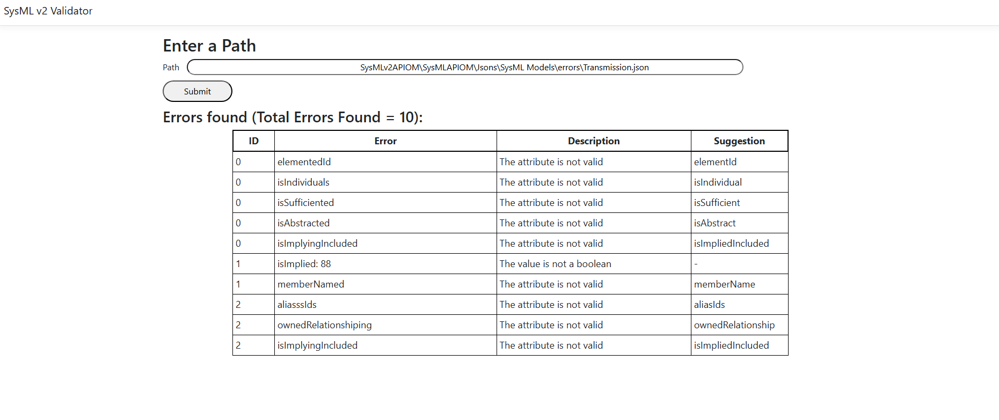
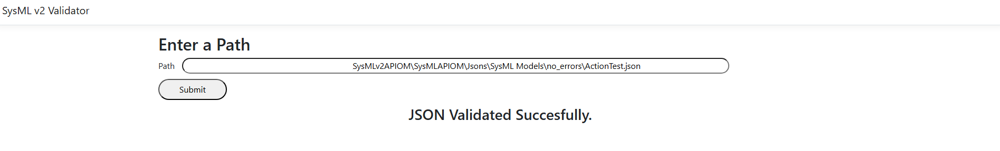

# SysML v2 Models Validation

## Abstract

Model-Based Systems Engineering (MBSE) relies on formal models for system lifecycle management, enhancing consistency and reusability. Modelling languages, particularly SysML v2, offer a standardised framework for complex system modelling, addressing limitations of earlier versions. However, validation of these models remains unexplored, posing risks to their accuracy and reliability in engineering workflows. This paper presents a systematic, metamodel-based method for validating SysML v2 models, utilising the SysML v2 metamodel as a formal specification. By defining validation rules derived from this metamodel, the method facilitates automated detection of structural and semantic inconsistencies. A practical case study validates the method on SysML v2 models of aerospace, automotive, and software development domains, demonstrating the systematic identification and resolution of errors. This research advances SysML v2 model validation, contributing to broader MBSE objectives by ensuring accurate SysML v2 models for complex system development in multi-disciplinary environments.
## Contents

- [Installation](#installation)
- [Usage](#usage)
- [Requirements](#requirements)
- [Repository Structure](#repository-structure)
- [Models](#models)
- [Use Case](#use-case)
    - [Model with errors](#model-with-errors)
    - [Model without errors](#model-without-errors)

- [License](#license)
- [Contributors](#contributors)

## Installation

Follow this instructions if you wish to run the Validator locally.

```sh
git clone https://github.com/pepe-olivert/SysMLv2_Implementation.git
```

## Usage


1. Open the sysMLv2APIOM.sln in Visual Studio 2022. <br>
2. Check that the WebApp_SysMLv2APIOM project is configured as the startup project.<br>
3. Run the project.

## Requirements

List of dependences needed to run the project:
- Visual Studio 2022
- .NET 8.0 or higher

## Repository Structure

The repository is divided by two different components. 
1. [SysMLAPIOM](./SysMLAPIOM/): In this path the core implementation of the SysML v2 API Object Model can be found, altogether with the implementation of the different functionalities of the Validator.
2. [WebApp_SysMLAPIOM](./WebApp_SysMLv2APIOM/): In this path the implementation of the User Interface can be found.

## Models

The various models presented in [HERE]() are categorized based on the presence or absence of errors and can be accessed in the following directory: [MODELS](./SysMLAPIOM/Jsons/SysML%20Models/)

## Use Case

### Model with errors

In the following image, an example of the Validator Process of a model with errors can be found.



### Model without errors

In the following image, an example of the Validator Process of a model with no errors can be found.




## Contributors

- {**ecibrian**, **jolivert**, **joalvare**, **llorens**}@inf.uc3m.es 
- {**carlos.diez**, **rmendieta**}@reusecompany.com

